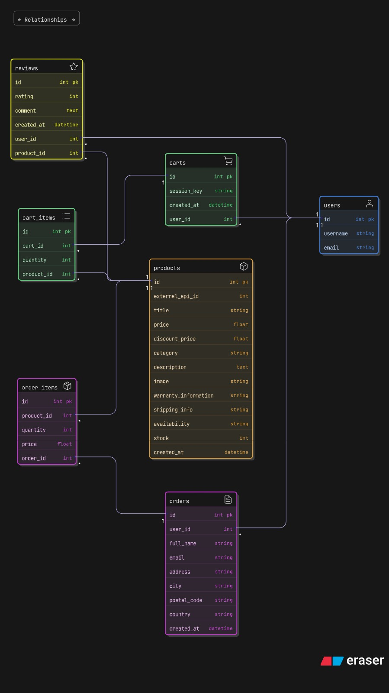

# Django E-Commerce Platform


**A modern, full-featured e-commerce solution built with Django and Tailwind CSS.**

---

## 📖 Table of Contents

- [What the project does](#what-the-project-does)
- [Why the project is useful](#why-the-project-is-useful)
- [How users can get started](#how-users-can-get-started)
- [Where users can get help](#where-users-can-get-help)
- [Who maintains and contributes](#who-maintains-and-contributes)

---

## What the project does

This project is a robust e-commerce web application designed to provide a seamless shopping experience. It handles the entire customer journey from product discovery to checkout.

**Key capabilities include:**
-   Produc browsing with category filtering and detailed views.
-   Full shopping cart management (add, update, remove items).
-   Secure user authentication, including social login (Google) via `django-allauth`.
-   User profile management.
-   Streamlined checkout process.
-   Responsive, modern UI powered by Tailwind CSS.

## Why the project is useful

This platform serves as a solid foundation for building scalable online stores. It leverages Django's "batteries-included" philosophy alongside modern frontend tooling to offer:

-   **Development Speed**: Rapid prototyping with hot-reloading (`django-browser-reload`) and Tailwind CSS.
-   **Security**: built-in protection against common web attacks (CSRF, XSS, SQL Injection) and secure authentication flows.
-   **Maintainability**: Clean project structure separating concerns into distinct apps (`shop`, `users`, `theme`).
-   **Extensibility**: Easy to add new payment gateways, shipping providers, or analytics tools.

## How users can get started

Follow these steps to set up the project locally for development.

### Prerequisites

-   **Python 3.10+** installed.
-   **Node.js & npm** installed (required for Tailwind CSS compilation).

### Installation

1.  **Clone the repository**
    ```bash
    git clone https://github.com/darshan3187/ecommerce-platform-django.git
    cd ecommerce-platform-django
    ```

2.  **Set up the Virtual Environment**
    ```bash
    # Create virtual environment
    python -m venv .venv

    # Activate it (Windows)
    .venv\Scripts\activate

    # Activate it (macOS/Linux)
    source .venv/bin/activate
    ```

3.  **Install Python Dependencies**
    ```bash
    pip install -r requirements.txt
    ```

4.  **Install Node.js Dependencies**
    Navigate to the theme app and install dependencies for Tailwind.
    ```bash
    cd ecomsite
    python manage.py tailwind install
    ```

5.  **Environment Configuration**
    Create a `.env` file in `ecomsite/ecomsite/` based on the example.
    
    ```bash
    # Copy the example file
    cp ecomsite/.env.example ecomsite/.env
    ```
    
    Update `.env` with your credentials:
    ```ini
    SECRET_KEY=your_secure_django_secret
    PRODUCTS_API=https://fakestoreapi.com/products
    CLIENT_ID=your_google_oauth_client_id
    SECRET=your_google_oauth_secret
    ```

6.  **Apply Database Migrations**
    ```bash
    # Ensure you are in the directory with manage.py
    python manage.py migrate
    ```

### Usage

To run the application, you need to run both the Django server and the Tailwind watcher.

1.  **Start Tailwind Watcher** (Terminal 1)
    ```bash
    python manage.py tailwind start
    ```

2.  **Start Django Server** (Terminal 2)
    ```bash
    python manage.py runserver
    ```

Visit `http://127.0.0.1:8000` in your browser.

## Where users can get help

-   **Issues**: If you encounter bugs or have feature requests, please [open an issue](https://github.com/darshan3187/ecommerce-platform-django/issues) on GitHub.
-   **Documentation**: For Django specific questions, refer to the [official Django documentation](https://docs.djangoproject.com/).
-   **Tailwind**: For styling help, check the [Tailwind CSS docs](https://tailwindcss.com/docs).
-   
## 🏗️ Project Structure

```
ecomsite/
├── ecomsite/              # Main Django project settings
│   ├── settings.py        # Project configuration
│   ├── urls.py           # URL routing
│   └── wsgi.py           # WSGI configuration
├── shop/                 # E-commerce app
│   ├── models.py         # Product, Cart, Order models
│   ├── views.py          # Product and checkout views
│   └── templates/        # Shop templates
├── users/                # User authentication app
│   ├── models.py         # Custom user model
│   └── views.py          # Login/signup views
├── theme/                # UI/Styling app
│   ├── static/           # CSS, JS, images
│   └── tailwind.config.js # Tailwind configuration
├── manage.py             # Django CLI
└── requirements.txt      # Python dependencies
```
## 🗄️ Database Schema

The following diagram represents the relational database design used in this e-commerce application.  
It illustrates the relationships between users, products, carts, orders, and reviews.



## ✨ Key Features

- **Product Management**: Browse products by category with filtering
- **Shopping Cart**: Add/update/remove items with persistent storage
- **User Authentication**: Secure signup/login with email verification
- **Google OAuth**: Social login integration via django-allauth
- **Order Management**: Complete order tracking and history
- **Responsive Design**: Mobile-first UI with Tailwind CSS
- **Email Notifications**: Automatic order confirmation emails
- **Admin Dashboard**: Django admin panel for product/order management

## 🚀 Future Improvements

- [ ] Payment gateway integration (Stripe, Razorpay)
- [ ] Wishlist & product reviews feature
- [ ] Search & advanced filtering
- [ ] Inventory management
- [ ] Email marketing integration
- [ ] Multi-currency support
- [ ] API endpoints for mobile app
- [ ] Unit & integration tests with pytest
- [ ] GitHub Actions CI/CD pipeline
- [ ] Docker containerization

## 📄 License

This project is licensed under the MIT License - see the LICENSE file for details.

## 👤 Author

**Darshan Rajgor**
- GitHub: [@darshan3187](https://github.com/darshan3187)
- Email: darshanrajgor73@gmail.com

---

**⭐ If you found this helpful, please consider starring the repository!**

